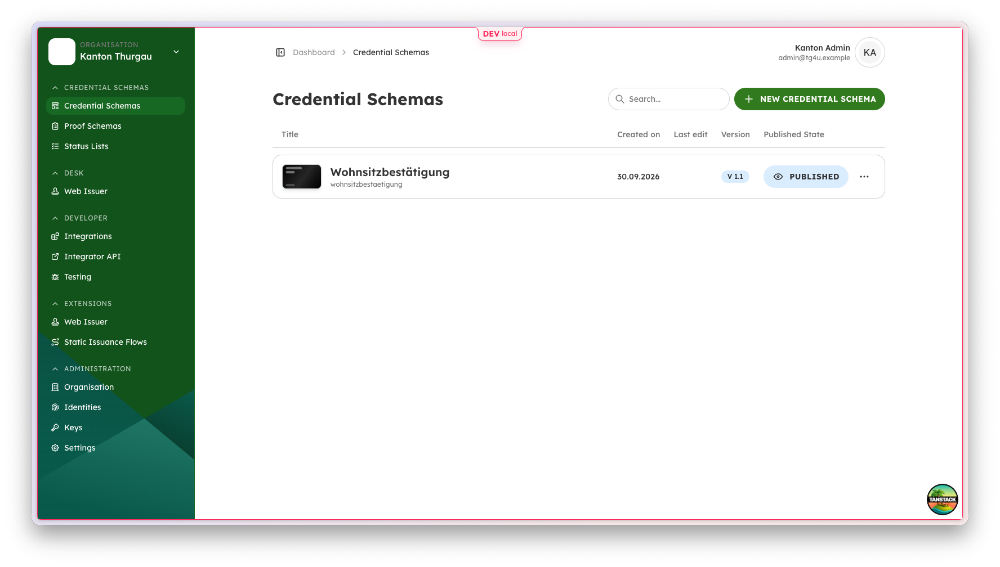
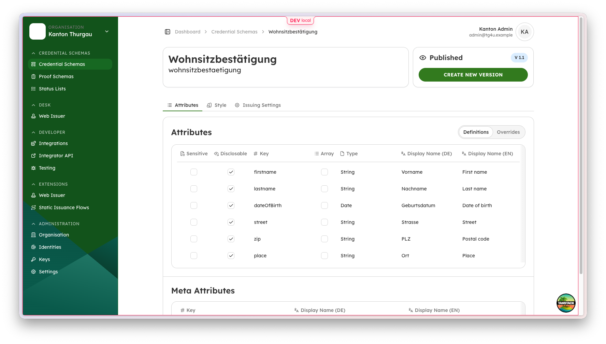
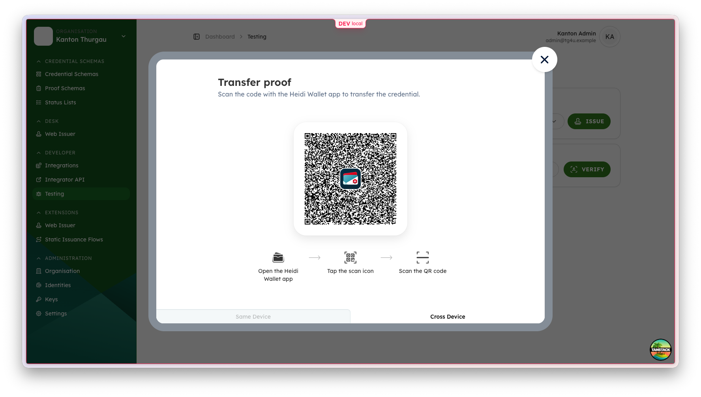

# TG4U / DVS4U

TG4U is a digital credentials platform for public authorities in Switzerland.
It is a project of the Canton of Thurgau, developed by Ubique Innovation's
Heidi team. It supports authorities that need to issue, manage, and verify
digital credentials and is intended as a basis for use by other cantons and
municipalities.

TG4U is part of the [DVS4U project](https://www.digitale-verwaltung-schweiz.ch/umsetzungsplan/projekte/behoerdenuebergreifende-digitale-identifikation-etablieren),
which develops the TG4U proof of concept into a minimum viable product for
integrating digital credential infrastructure into existing cantonal and
municipal systems. The project contributes to Switzerland's wider e-ID and
swiyu ecosystem.

## Screenshots

<table>
  <tr>
    <td></td>
    <td></td>
    <td></td>
  </tr>
</table>

## Project status and compatibility

This repository is published at the conclusion of the TG4U development project
and captures the implementation delivered at that point in time.

At publication in September 2026, the project was compatible with the
then-current development state of the [swiyu wallet and trust
infrastructure](https://www.eid.admin.ch/). The wallet, infrastructure, and
related interfaces evolve over time. Re-check compatibility with the exact
versions and environment you plan to use.

## Production security warning

> [!CAUTION]
> **Do not deploy this project as-is in production or expose its services
> directly to the Internet.** The Helm chart ships without a login proxy and
> defaults backend services to the `no-security` profile, which grants every
> role to every caller.
>
> Before production use, put an identity-aware proxy in front of the deployment
> and connect it to an OIDC identity and access management (IAM) system.
> Configure authentication and authorization for the application APIs as well:
> validate the intended OIDC tokens, assign only the roles and tenant access
> each user needs, and prevent direct access to backend services. Preserve only
> the unauthenticated issuer or verifier protocol endpoints intentionally
> required by wallets or integrations.
>
> Using an HSM-backed signing service is recommended. See the Heidi Platform
> [HSM-backed signing service example](https://github.com/heidiverse/heidi-platform/blob/main/docs/examples/custom-hsm-signing-service.md).
> Configure production-grade TLS, secrets management, network policies,
> database operations, monitoring, and backups before handling real credentials
> or personal data.

See the [Helm chart security and authentication guide](helm/tg4u-platform/README.md#authentication) for deployment-specific configuration. A proxy by itself does not make the default `no-security` application profile suitable for production.

## Built on Heidi Platform

TG4U extends the public [Heidi Platform repository](https://github.com/heidiverse/heidi-platform),
which provides the core platform, APIs, issuer, verifier, signing components,
and cockpit. TG4U adds project-specific web and backend extensions; it is not a
replacement for Heidi Platform.

The exact upstream repository revision used for a build is recorded in
[`oss.lock`](oss.lock). The build assembles the TG4U extensions into a generated
Heidi Platform checkout. The extensions are not published as standalone Maven
or npm packages.

## Heidi Platform documentation

The upstream repository provides additional guidance for developing and
operating the platform:

- [README and prerequisites](https://github.com/heidiverse/heidi-platform/blob/main/README.md)
- [Getting started](https://github.com/heidiverse/heidi-platform/blob/main/docs/getting-started.md)
- [Authentication and authorization](https://github.com/heidiverse/heidi-platform/blob/main/docs/authentication.md)
- [Deployment](https://github.com/heidiverse/heidi-platform/blob/main/docs/deployment.md)
- [HSM-backed signing service example](https://github.com/heidiverse/heidi-platform/blob/main/docs/examples/custom-hsm-signing-service.md)

## Platform overview

The underlying Heidi Platform is a multi-tenant platform for public authorities.
Organizations (tenants) can manage credential schemas and use the platform to
issue and verify verifiable credentials. Deployments can connect an identity
and access management (IAM) system for operator and API authentication.
Credential-schema templates can also be imported from the Swiss
[I14Y Interoperability Platform](https://www.i14y.admin.ch/).

Services can integrate issuance and presentation workflows into their existing
systems through the platform's Integration API and browser interaction flow.
See the next section for the integration guide.

## Integrate with existing services

An integrating service typically starts an issuance or presentation process
from its backend through Heidi's Integration API. Its frontend then uses Heidi
Web Components or a custom client to continue the wallet interaction, while the
backend retrieves the final result. The [Heidi Platform integrator guide](https://github.com/heidiverse/heidi-platform/blob/main/docs/integration-guide.md)
describes the process, API calls, and token boundaries in detail.

## Local development

### Prerequisites

Install:

- Git
- [`just`](https://just.systems/) command runner
- Java 21, Maven, and Gradle
- Rust and the targets required by the Heidi Platform build
- Node.js 24 and pnpm 11
- Docker with Docker Compose
- OpenSSL

The [Heidi Platform README](https://github.com/heidiverse/heidi-platform/blob/main/README.md#prerequisites)
describes its toolchain and local development environment.

### Build and run

From the repository root:

```sh
just setup
just dev
```

`just setup` prepares a generated Heidi Platform checkout at the revision in
`oss.lock` and installs the combined frontend dependencies. `just dev` builds
the TG4U backend extensions and starts the local platform services. The
generated upstream checkout is kept under `.tg4u/platform/` and is ignored by
Git. The local profile creates a Kanton Thurgau tenant and issuer identity and
a Kanton Admin user (`admin@tg4u.example`). It also seeds a sample
Wohnsitzbestätigung credential and presentation proof from TG4U-owned fixtures.
Both use the Custom trust profile;
the default local setup does not provision Swiss trust. Set
`HEIDI_SCHEMA_SEED_MANIFEST` to use a different schema seed manifest.

Run `just --list` to see available commands, including commands to start
individual services and build or test specific components. These commands are
for local development, not production deployment.

## Deploy with Helm

The [`helm/tg4u-platform`](helm/tg4u-platform) chart deploys the five services.
Its [README](helm/tg4u-platform/README.md) documents image configuration,
authentication, database options, and installation. Set `global.imageTag` to a
published release tag when installing the chart.

The release workflow publishes these images to the Kanton Thurgau GHCR
namespace:

| Service | Image |
| --- | --- |
| Platform API | `ghcr.io/amt-fur-informatik-kanton-thurgau/tg4u-platform-api` |
| Issuer | `ghcr.io/amt-fur-informatik-kanton-thurgau/tg4u-issuer` |
| Verifier | `ghcr.io/amt-fur-informatik-kanton-thurgau/tg4u-verifier` |
| Signing service | `ghcr.io/amt-fur-informatik-kanton-thurgau/tg4u-signing-service` |
| Cockpit web | `ghcr.io/amt-fur-informatik-kanton-thurgau/tg4u-web` |

Releases are created from `vMAJOR.MINOR.PATCH` tags. The `v` is removed from
the image tag; stable releases also receive the `latest` tag. Refer to the
chart documentation for the current deployment configuration.

## License

TG4U is licensed under the [Apache License 2.0](LICENSE).
